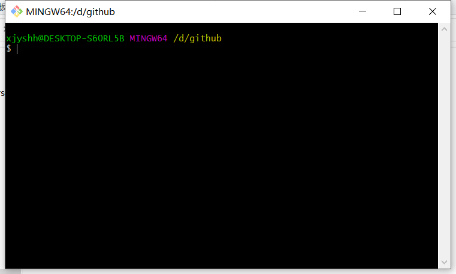

<p align="center">
  
<p align="center">

- [1. 本地操作](#1-本地操作)
- [问题描述](#问题描述)

# 1. 本地操作

- 首先右键会出现两个新选项，分别为Git Gui Here,Git Bash Here,这里我们选择Git Bash Here，进入如下界面，当前位置：**D:/github**
<p align="center">
  
<p align="center">

- 将github上面的仓库克隆到本地

    ```python
    git clone https://github.com/Xujiayue0721/github.git
    ```

- 接下来依次输入以下代码即可完成其他剩余操作：

    ```
    git add . 
    （后面的 . ，此操作是把Test文件夹下面的文件都添加进来）
    
    git commit -m "提交信息"  
    （注：“提交信息” 里面换成你需要，如 “first commit”）

    git push -u origin master   
    （注：此操作目的是把本地仓库push到github上面）
    ```

# 问题描述

    git push 失败。
    浏览器可以正常访问 github.com

- **ssl 异常**
  ```python
  OpenSSL SSL_read: Connection was reset, errno 10054
  ```
    

    解决方案
    ```python
    git config --global http.sslVerify "false"
    ```

