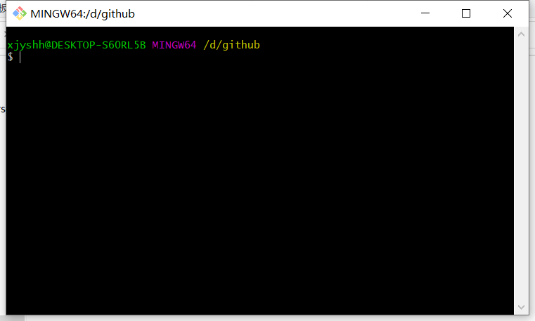
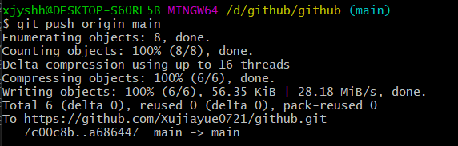

<p align="center">
  
<p align="center">

- [1. 本地操作](#1-本地操作)
  - [1.1 身份验证](#11-身份验证)
  - [1.2 数据上传](#12-数据上传)
- [2. 问题描述](#2-问题描述)

# 1. 本地操作

## 1.1 身份验证

```python
https://docs.github.com/en/authentication/keeping-your-account-and-data-secure/about-authentication-to-github
```

本人使用的是个人访问令牌--[Personal access tokens](https://docs.github.com/en/authentication/keeping-your-account-and-data-secure/creating-a-personal-access-token)

***

## 1.2 数据上传

- 首先右键会出现两个新选项，分别为Git Gui Here,Git Bash Here,这里我们选择Git Bash Here，进入如下界面，当前位置：**D:/github**

<p align="center">
  
<p align="center">

- **方法一**：将github上面的仓库克隆到本地

    ```python
    git clone https://github.com/Xujiayue0721/github.git
    ```

- 接下来依次输入以下代码即可完成其他剩余操作：

    ```python
    git add . 
    （注：后面的 . 是把Test文件夹下面的文件都添加进来）

    git commit -m "提交信息"  
    （注：“提交信息” 里面换成你需要，如 “first commit”）

    git pull origin main:master

    git push -u origin main  
    （注：
        此操作目的是把本地仓库push到github上面
        github的默认分支为main，在提交时需要提交到main，而不是master）
    ```

    默认分支名称(main)更改：

    ```python
    https://github.com/settings/repositories
    ```

    **git pull与git push的区别**:
    [详情](./doc/doc_ch/git.md)

    ```python
    git push <远程主机名> <本地分支名>:<远程分支名>
    # 本地分支是指将要被推送到远端的分支，而远程分支是指推送的目标分支

    git pull <远程主机> <远程分支>:<本地分支>
    # 与 git push操作的目的相同，但是操作的目标相反
    ```

- **上传成功**：

<p align="center">
  
<p align="center">

# 2. 问题描述

- **问题1**

    ```python
    # git push 失败，浏览器可以正常访问 github.com
    # ssl 异常
    OpenSSL SSL_read: Connection was reset, errno 10054

    # 解决方案
    git config --global http.sslVerify "false"
    ```

- **问题2**

    ```python
    代理导致

    # 解决方案
    git config --global --unset http.proxy
    git config --global --unset https.proxy # 取消代理
    ```

- **问题3**

    ```python
    error: src refspec master does not match any.
    error: failed to push some refs to 

    # 主要原因
    本地git仓库目录下为空
    本地仓库add后未commit
    git init错误
    没有先进行git pull
    ```

- **问题4**

    ```python
    Failed to connect to github.com port 443:connection timed out

    修改 hosts 文件
    ```
